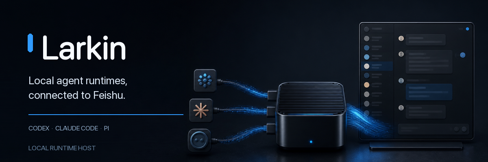

<p align="center">
  
</p>

<p align="center">
  <a href="#quick-start">Quick start</a> · <a href="#requirements">Requirements</a> · <a href="#what-it-does">What it does</a> · <a href="#installation">Installation</a> · <a href="#usage">Usage</a> · <a href="#setup-and-configuration">Setup and configuration</a> · <a href="#details">Details</a> · <a href="#development">Development</a>
</p>

Larkin is a local Runtime Host that connects Codex, Claude Code, and Pi agent runtimes to Feishu (Lark). It keeps sessions, reminders, interactive messages, and a local dashboard close to the machine that runs them.

## Downstream distribution maintenance / 下游发行版维护

`dalianzhu/larkin` 是基于 [`eddiearc/larkin`](https://github.com/eddiearc/larkin) 维护的下游发行版，两者采用类似 Linux core 与发行版的协作关系。

### 上游与下游边界

- `eddiearc/larkin` 是上游核心，负责纯粹、通用的飞书能力，包括飞书 API 适配、Runtime Host 核心架构、消息安全边界和通用交互能力。
- `dalianzhu/larkin` 是可构建、安装和实际运行的下游发行版。在上游核心之上维护本地业务所需的通用扩展，例如经认证的 external agent enqueue。
- 上游坚持“所有 Agent 数据源来自飞书”；下游允许受认证的本地自动化向 Agent 投递通用消息。这是双方已确认的产品边界，不以合入上游为目标。
- 下游 external enqueue 使用 `runtime:external` 作为 canonical Runtime wake target；它不是用户消息回复目标，必须保留 source kind、message ID 前缀和无 chat/thread locator 的一致性校验。
- 业务语义应尽量留在调用方。例如 Quality Gate 负责在消息正文中提供 flow、任务和目标信息；Larkin 的 enqueue 只负责可靠投递任意消息，不理解 Quality Gate 或特定飞书路由。
- `origin/main` 代表下游可发布版本，可以有意领先并偏离上游；`upstream/main` 始终代表官方核心，不在本仓库另建“纯净 main”副本。

本地 remote 约定：

```text
origin    git@github.com:dalianzhu/larkin.git
upstream  git@github.com:eddiearc/larkin.git
```

首次配置：

```bash
git remote add upstream git@github.com:eddiearc/larkin.git
git fetch --no-tags upstream main
```

### 分支与开发流程

下游需求从最新的 `origin/main` 切功能分支，完成测试后合回下游 `main`：

```bash
git switch main
git pull --ff-only origin main
git switch -c codex/<feature-name>
# 开发、测试、提交、推送
git switch main
git merge --no-ff codex/<feature-name>
git push origin main
```

适合贡献给官方的纯核心改动必须直接从 `upstream/main` 切分支，避免把下游功能夹带进上游 PR：

```bash
git fetch --no-tags upstream main
git switch -c upstream-fix/<change-name> upstream/main
```

### 同步上游

已发布的下游 `main` 不做 rebase 或 force-push。同步官方时使用 merge，保留下游版本的完整来源：

```bash
git fetch --no-tags upstream main
git switch main
git pull --ff-only origin main
git merge --no-ff upstream/main
bun install --frozen-lockfile
bun test
git push origin main
```

同步时必须审查冲突是否跨越以下边界：本地控制面、Inbox、freshness、飞书身份锁定、Runtime 唤醒和 release tooling。不能为了快速同步而绕过这些安全约束。

不要把上游 tags 镜像到 `origin`，也不要使用 `git push --tags`。上下游 release tooling 都使用 `vX.Y.Z` 标签，混合标签会造成同名 tag 指向不同提交。同步上游只获取 branch，使用 `--no-tags`。

### 版本号管理

- 下游继续使用仓库现有的稳定 SemVer `MAJOR.MINOR.PATCH`，不使用当前 release tooling 不支持的预发布后缀。
- 每个可发布的下游功能或修复都必须递增版本；默认递增 `PATCH`，不复用任何已经发布的下游版本号。
- 同步上游后，比较 `upstream/main` 的 `package.json` 版本与最近一个下游发布版本，取较大者作为基线，再至少递增一次 `PATCH`。例如上游为 `0.2.58`、下游已发布 `0.2.59`，下一个下游版本应为 `0.2.60`。
- `MINOR` 和 `MAJOR` 仅用于确有对应兼容性语义的变更，不用来标识“来自下游”。发行版身份由仓库地址、release manifest 的 `sourceCommit` 和构建来源共同确认。
- release commit 必须保持工作树干净、已推送，并通过 typecheck、build、测试、license 和 publication checks；安装工件必须显示 `sourceDirty: false`。
- 发现上下游使用了相同版本号时，不覆盖、不移动已有 tag；下游直接递增到新的未使用版本，并从明确的上游 commit 重新构建。

当前发行关系：下游已同步上游 `eddiearc/larkin@5a78e2d`（`0.5.5`），该版本上游已移除内置（builtin）Pi、全面转向外部安装的 `pi` 运行时；下游在此基础上保留 external enqueue，发行版本为 `0.5.6`。后续同步时以实际的 `upstream/main` 和下游最新 release 为准，不把本段中的 commit 当作永久固定基线。

## Requirements

- A supported macOS, Linux, or Windows (x64) system
- Official `@larksuite/cli >= 1.0.80` (`lark-cli`) (Larkin product policy)
- At least one externally installed agent runtime on `PATH`, already logged in: `pi`, `codex`, or `claude`
- Bun 1.3.14 when running the npm package or building from source (standalone binaries bundle their own runtime)

## Quick start

```bash
npx larkin@latest setup
npx larkin@latest start
npx larkin@latest status
```

## What it does

<table>
<tr>
<td valign="top">

**Runtime host**

Connect supported coding-agent runtimes to Feishu from one local process.

</td>
<td valign="top">

**Persistent workflow**

Keep sessions and reminders available across runs.

</td>
</tr>
<tr>
<td valign="top">

**Message surfaces**

Work with Feishu messages, interactive cards, and related automation.

</td>
<td valign="top">

**Local visibility**

Inspect the host through the embedded dashboard and OpenTelemetry traces.

</td>
</tr>
</table>

The rest of this document uses the short `larkin` form; it works as-is after `npm install -g larkin`, or prefix any command with `npx larkin@latest` to run it without installing.

## Installation

Prefer npm:

```bash
# Run the latest version directly with npx — no install step, always the newest release
npx larkin@latest setup

# Or install globally and use the plain `larkin` command
npm install -g larkin
larkin --version
```

Standalone binaries for macOS, Linux, and Windows (x64) are attached to every [GitHub Release](https://github.com/eddiearc/larkin/releases) for environments without Bun or npm. The Windows 11 x64 core path has passed native end-to-end startup verification. Pull requests and releases also have a blocking native Windows gate that verifies the standalone executable's manifest and SHA-256 before checking its version, help output, and embedded Dashboard over HTTP.

## Usage

Run `larkin --help` or `larkin config --help` for the available commands and configuration options. `larkin agents` reports event readiness, reply-scope readiness, subscription mode/status/dimension, arrivals, and read failures. Local configuration is stored under `~/.larkin` by default; set `LARKIN_CONFIG_DIR` to use another directory.

### Feishu message links

Feishu clients do not reliably render Markdown links such as `[label](URL)` as clickable in text or Markdown messages. When a recipient must be able to open a link, keep the complete bare HTTPS URL visible, for example: Issue 115 — https://github.com/eddiearc/larkin/issues/115. A label may accompany it, but must not replace the bare URL. Larkin does not rewrite exact, verbatim, or user-authored message bodies to enforce this guidance.

## Setup and configuration

Feishu (https://open.feishu.cn) and Lark (https://open.larksuite.com) are different platforms; `larkin setup` must be told which brand with `--tenant feishu|lark` or the interactive prompt before the authorization QR, and must never emit a `feishu.cn` host for a Lark tenant.

During setup, choose one of the three externally installed runtimes: Pi (`pi`), Codex (`codex`), or Claude Code (`claude`). Larkin does not ship a runtime and does not store provider credentials. Install the runtime yourself and complete its own login (`pi` login flow, `codex login`, or `claude login`) before setup. Interactive setup lists each runtime as installed or not installed and refuses a missing binary; non-interactive setup requires `--runtime` and exits non-zero with the same missing-install message.

`larkin setup --model <id>` optionally stores a catalog model for that runtime. After setup, use `larkin model` and `larkin runtime` to inspect or switch. For Pi, Larkin talks to your installed `pi --mode rpc` and verifies the RPC handshake and compaction capability contract.

### Optional Pi tmux-backed bash

On macOS and Linux with `tmux` 3.2 or newer installed, Larkin provides a small tmux-backed Bash tool. Commands run in their requested directory, including non-Git directories and paths with spaces. By default the tool waits up to 30 seconds, then returns a `taskId` while the same command continues; `background: true` returns immediately. The `tmux` tool lists, inspects and stops tasks owned by that Pi instance. Completed background commands notify the Agent. There is no Larkin-imposed 60-second kill or ten-minute command limit.

Without a supported tmux version, or on native Windows, Pi keeps native bash. After Pi shuts down, background commands remain in tmux, but automatic completion notifications are not restored; use `tmux list-sessions` to find the session containing the task ID and attach manually. Larkin does not require a third-party tmux plugin.

### Optional Inbox Audit

Inbox Audit is **off by default**. In the Dashboard, use **Global settings → Inbox 巡检** to configure the switch and inspection gap, or the selected Agent's **Configuration → Inbox 巡检** to override either value. The gap defaults to 15 minutes and supports 1 minute to 24 hours. Saving a gap alone keeps auditing disabled; saved settings survive restart and update later scheduling without replacing the Agent Runtime session.

The same settings are available through the CLI:

```bash
larkin config inbox-audit global on --interval 15m
larkin config inbox-audit agent off --agent <App-ID>
larkin config inbox-audit agent inherit --agent <App-ID> --interval inherit
larkin config inbox-audit global off
```

When enabled, audit only revisits originally wake-eligible human group/topic work and does not wake a model for an empty work list. Reading an audit list does not complete it: the managed Agent follows the returned inspection instructions and explicitly confirms the receipt after checking. A failed check remains retryable; newer messages cannot be completed by an older receipt. Old audit-index records without proven eligibility or observation identity are ignored; ordinary Inbox messages and conversation history are preserved.

<details>
<summary>Windows support and optional autostart</summary>

Windows 11 x64 core support covers the standalone CLI, local Runtime Host startup, and the embedded Dashboard. The official `lark-cli` and the chosen external Codex, Claude Code, or Pi executable remain separately installed dependencies; secret-bearing live channel/runtime tests are intentionally outside the hosted Windows CI gate.

An Administrator account can optionally start Larkin at that account's interactive logon with Task Scheduler. From an elevated PowerShell prompt, adjust the executable and working-directory paths first:

```powershell
$Exe = 'C:\Tools\Larkin\larkin.exe'
$WorkDir = 'C:\Tools\Larkin'
$Action = New-ScheduledTaskAction -Execute $Exe -Argument 'start' -WorkingDirectory $WorkDir
$Trigger = New-ScheduledTaskTrigger -AtLogOn -User $env:USERNAME
Register-ScheduledTask -TaskName 'Larkin Runtime Host' -Action $Action -Trigger $Trigger `
  -Description 'Start Larkin for this Administrator account at logon' -RunLevel Highest
```

This is an optional per-user Administrator-logon task, not SYSTEM boot support or a Windows service. Keep the account profile available because Larkin stores its state there. Release executables are currently unsigned; normal Windows security policy and SmartScreen decisions still apply.
</details>

## Details

<details>
<summary>OpenTelemetry traces</summary>

Larkin records a privacy-safe timing waterfall for each woken Feishu message. Tracing is always enabled, and ended spans first enter a durable local OTLP/HTTP JSON spool. Message processing therefore does not depend on an observability backend being reachable.

Local recording needs no enable flag. Configure an endpoint only when this computer should upload automatically:

```bash
# Optional: without an endpoint, traces remain only in the local spool.
export LARKIN_TELEMETRY_OTLP_ENDPOINT=https://collector.example/v1/traces
# Optional comma-separated name=value fields; never persisted or printed.
export LARKIN_TELEMETRY_OTLP_HEADERS='Authorization=Bearer%20REDACTED'
larkin start
```

The default spool is `$LARKIN_HOME/telemetry/spool`. Its directory and files use modes `0700` and `0600`. Defaults are 64 MiB, 10,000 files, and 14 days; override them with `LARKIN_TELEMETRY_MAX_BYTES`, `LARKIN_TELEMETRY_MAX_FILES`, and `LARKIN_TELEMETRY_MAX_AGE_MS`. Network errors and rejected uploads remain queued. A successful HTTP 200 acknowledges the local batch; an OTLP `partialSuccess` with rejected spans is recorded as a safe drop and is not retried.

`larkin telemetry status` reports bounded queue and endpoint metadata without paths, message text, prompts, model output, commands, credentials, real user IDs, raw errors, headers, or complete URLs. Trace attributes use hashes and low-cardinality enums. `inbox.consume` measures the authoritative direct `larkin inbox poll` operation and inherits the active `agent.turn`. Pi traces add `pi.rpc.submit`, `pi.rpc.lifecycle`, `pi.output.wait`, `pi.generation`, `pi.tool.wait`, and `pi.rpc.settle`, exposing submit-to-accept, observed first-output, tool wait, and settle timing. Document-comment traces expose receive, safe gate, pending/replay, Inbox, Runtime, and an independent `document.comment.reply` client result without recording comment locators or bodies.

### Offline transfer

On the computer running Larkin:

```bash
larkin telemetry status
larkin telemetry export --output larkin-traces.json.gz
```

Export uses copy semantics and does not delete the source queue. Move the bundle to a computer that can reach the collector, then run:

```bash
larkin telemetry import --input larkin-traces.json.gz
larkin telemetry flush --endpoint http://127.0.0.1:4318/v1/traces
```

Bundles contain versioned OTLP payloads and SHA-256 checksums. Import validates the complete bundle before mutation, assigns local queue identities, and is idempotent. Trace IDs, parentage, status, and timestamps are preserved across export and import.

### Grafana OTEL-LGTM

The repository includes a development-only stack pinned to `grafana/otel-lgtm:0.27.1`:

```bash
docker compose -f deploy/otel-lgtm/compose.yaml up -d
larkin telemetry flush --endpoint http://127.0.0.1:4318/v1/traces
# Content-free Collector + Tempo semantic acceptance check:
bun run test:telemetry:lgtm
```

Open <http://127.0.0.1:3000>, sign in with the image's development default (`admin` / `admin`), then use **Explore → Tempo** and search for `service.name = larkin` or paste a trace ID. A complete trace contains:

```text
larkin.message.process
├── feishu.receive
├── runtime.deliver
└── agent.turn
    ├── model.activity
    ├── tool.execute
    ├── inbox.consume
    └── feishu.send
```

The compose stack binds Grafana, Tempo, and OTLP only to `127.0.0.1` and persists `/data`. It is intended for development, demos, and testing. Do not expose its default credentials or plaintext OTLP port publicly; use a deployment-owned TLS/authenticated endpoint or private network for remote automatic upload.
</details>

## Development

```bash
bun install --frozen-lockfile
bun run build
bun test
```

Use `bun run publication:check:tree` to verify the repository publication boundary and `bun run licenses:check` to verify the runtime-only third-party notice generator.

## License and security

Larkin is licensed under the [Apache License 2.0](./LICENSE). Runtime dependency notices are generated and included with every release. See [CONTRIBUTING.md](./CONTRIBUTING.md) before submitting changes and [SECURITY.md](./SECURITY.md) for private vulnerability reporting.
